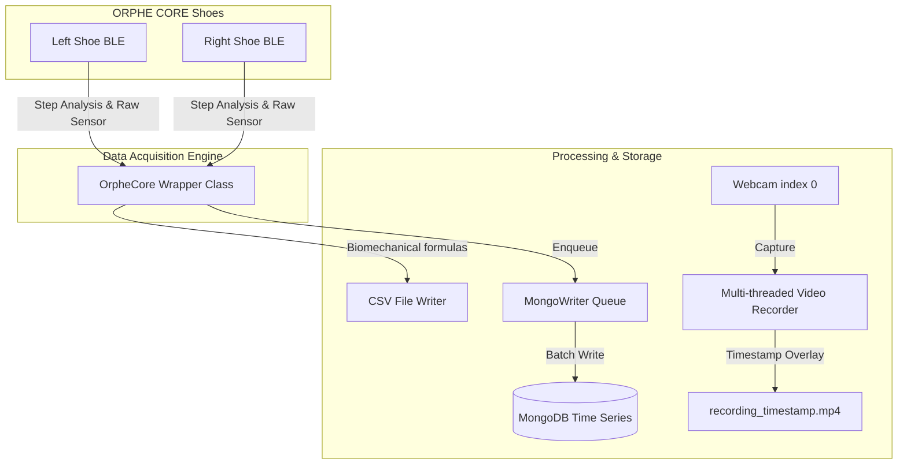

# ORPHE-CORE.py (Extended Internship Version)

Happy hacking for ORPHE CORE with python!!
โปรเจกต์นี้เป็นเวอร์ชันปรับปรุงและพัฒนาเพิ่มเติมสำหรับบอร์ดเซนเซอร์ **ORPHE CORE** เพื่อรองรับการเก็บข้อมูลการเดิน/วิ่งจากรองเท้าทั้ง 2 ข้าง (ซ้าย-ขวา) พร้อมกัน, การจัดเก็บข้อมูลลงฐานข้อมูล MongoDB แบบประสิทธิภาพสูง (Time Series), การคำนวณไบโอเมกคานิกส์ 59 คอลัมน์ตามมาตรฐาน ORPHE, และการอัดวิดีโอซิงโครไนซ์เพื่อการทำ Data Annotation

---

## สรุปฟีเจอร์ที่พัฒนาเพิ่มเติม (New Features Added)

1. **Dual Shoe Synchronous Acquisition**: รองรับการเชื่อมต่อกับอุปกรณ์ ORPHE CORE 2 ตัวพร้อมกัน (Left & Right) ผ่าน BLE โดยมีระบบสแกนหาและเชื่อมต่ออัตโนมัติ (Auto-scanning & connection)
2. **Biomechanical Parameter Calculation & 59-Column CSV (`save_gait_csv.py`)**: ระบบดึงข้อมูลแบบ Asynchronous จากเซนเซอร์แต่ละข้างมารวมกันเป็นแต่ละก้าวอย่างสมบูรณ์ และประมวลผลคำนวณค่า biomechanical ต่างๆ เช่น ความยาวก้าว (Step/Stride length), ช่วงเวลาลงเท้า (Stance/Swing duration), ดัชนีความสมมาตร (Symmetry), แรงกระแทก (Landing impact) และส่งออกในรูปแบบไฟล์ CSV มาตรฐาน 59 คอลัมน์ของ ORPHE
3. **MongoDB Time Series Integration (`get_step_analysis.py`)**: พัฒนาระบบจัดเก็บข้อมูลดิบ (Raw Sensor 50Hz/200Hz) และข้อมูลก้าวเดิน (Step Analysis) ลง MongoDB ในรูปแบบ **Time Series Collection** โดยใช้สถาปัตยกรรม Queue-Writer ร่วมกับ Multi-threading เพื่อรับส่งข้อมูลความเร็วสูงโดยไม่ขัดขวางการทำงานหลักของ BLE
4. **Webcam Video Synchronization (`get_step_analysis_with_video.py`)**: ระบบควบคุมกล้องเว็บแคมแยก Thread บันทึกวิดีโอพร้อมประทับเวลาที่มีความละเอียดระดับมิลลิวินาที (Millisecond timestamp overlay) ลงบนเฟรมแบบเรียลไทม์ ทำให้สามารถเทียบวิดีโอกับข้อมูลเซนเซอร์แบบ Frame-by-Frame ได้อย่างแม่นยำ
5. **MongoDB Analysis Utility (`read_mongodb.py`)**: สคริปต์สืบค้นและวิเคราะห์ข้อมูลเบื้องต้นจาก MongoDB แสดงสถิติและตัวอย่างแพ็กเก็ตที่บันทึกได้

---

## สถาปัตยกรรมระบบ (System Architecture)



---

## Requirements

* Python 3.10 ขึ้นไป
* MongoDB (ถ้าใช้ฟังก์ชันฐานข้อมูล)
* แพ็กเกจไพธอนเสริม:
```bash
pip install bleak pymongo opencv-python matplotlib python-osc
```

---

## คู่มือการใช้งานสคริปต์ที่พัฒนาขึ้นใหม่ (New Scripts Guide)

### 1. บันทึกข้อมูลก้าวเดิน + เซนเซอร์ดิบ + ลง MongoDB
สคริปต์ `get_step_analysis.py` ทำหน้าที่เชื่อมต่อรองเท้า 2 ข้าง เก็บข้อมูลแบบ Real-time บันทึกลงไฟล์ CSV 2 ไฟล์ และส่งเข้า MongoDB
```bash
python get_step_analysis.py
```
* **ผลลัพธ์ที่ได้**:
  * `gait_analysis_[Timestamp].csv`: ข้อมูลก้าวเดินรายก้าว (Step count, Speed, Stride, Cadence, Impact, Pronation, Quaternion, XYZ Distance, Phase)
  * `sensor_raw_[Timestamp].csv`: ข้อมูลดิบความถี่สูง (Acc, Gyro, Quat)
  * ฐานข้อมูล MongoDB: `orphe_gait_db` (Collections: `gait_analysis` และ `sensor_raw`)

### 2. บันทึกข้อมูลพร้อมบันทึกวิดีโอด้วยกล้องเว็บแคม (Video Synchronization)
สคริปต์ `get_step_analysis_with_video.py` ทำหน้าที่เหมือนตัวแรก แต่เพิ่มการเปิดกล้องเว็บแคมเพื่อถ่ายวิดีโอและซิงก์เวลาระดับมิลลิวินาที
```bash
python get_step_analysis_with_video.py
```
* **ผลลัพธ์ที่ได้**:
  * ข้อมูล CSV และ MongoDB
  * ไฟล์วิดีโอ `recording_[Timestamp].mp4` ที่มีเวลากำกับบนเฟรม ใช้เทียบเฟรมต่อเฟรมกับข้อมูลเซนเซอร์ในจุดที่สนใจ

### 3. บันทึกรายงานการเดินมาตรฐาน ORPHE (59 คอลัมน์)
สคริปต์ `save_gait_csv.py` คำนวณความสมมาตรซ้ายขวา (Symmetry) รอบจังหวะ (Rhythm) อัตราลงเท้าเฉลี่ย รวมถึงคะแนนวิเคราะห์ 4 ด้าน (Propulsion, Consistency, Symmetry, Absorption)
```bash
python save_gait_csv.py
```
* **ผลลัพธ์ที่ได้**:
  * `orphe_gait_analysis.csv` ที่มีโครงสร้างคอลัมน์เหมือนรายงานทางการของ ORPHE App ทั้งหมด 59 คอลัมน์

### 4. ตรวจสอบข้อมูลใน MongoDB
ใช้ `read_mongodb.py` เพื่อเช็กจำนวนข้อมูล ช่วงเวลา และตัวอย่างเอกสารในฐานข้อมูล
```bash
python read_mongodb.py
```

---

## โครงสร้างฐานข้อมูล MongoDB (MongoDB Schema)

ฐานข้อมูลชื่อ `orphe_gait_db` มีการตั้งค่าคอลเลกชันประเภท **Time Series** เพื่อรองรับความเร็วในการสืบค้น:

* **gait_analysis**:
  * `timestamp`: วันที่และเวลาประทับ (ISODate)
  * `metadata`: `{ device_address, side }`
  * `metrics`: step_count, speed, stride_length_cm, cadence, strike_angle, landing_impact, pronation, propulsion, absorption, phase, period, event, etc.

* **sensor_raw**:
  * `timestamp`: วันที่และเวลาประทับ (ISODate)
  * `metadata`: `{ device_address, side, sensor_type }` (sensor_type: GYRO, ACC, QUAT)
  * `values`: x, y, z, (w) พร้อมด้วย `packet_number` และ `serial_number`

---

## สคริปต์ดั้งเดิมและการทดสอบฮาร์ดแวร์พื้นฐาน (Original Scripts Reference)

### 1. ทดสอบการเชื่อมต่อและไฟกระพริบ LED (LED Blink Test)
ตรวจสอบการเชื่อมต่อกับอุปกรณ์ CORE ตัวแรกว่าทำงานถูกต้องหรือไม่
```bash
python blink_led.py
```

### 2. ดึงค่าเซนเซอร์ดิบแสดงผลบนคอนโซล (Read Raw Sensor)
```bash
python get_sensor_values.py
```

### 3. สแกนหาอุปกรณ์บลูทูธ (Scan BLE Devices)
ใช้สแกนหาที่อยู่ MAC Address ของ CORE เพื่อเอามาใส่ในตัวแปร `DEVICE_ADDRESSES` ในสคริปต์ต่าง ๆ
```bash
python scan.py
```

### 4. ดึงข้อมูลตัวเครื่อง (Device Information)
```bash
python device_information.py
```

### 5. พลอตค่าเซนเซอร์แบบเรียลไทม์ (Real-time Visualization)
```bash
python plot_sensor_values.py
```

### 6. ส่งข้อมูลเซนเซอร์ผ่านโปรโตคอล OSC (OSC Streaming)
```bash
python osc.py
```

### 7. โปรแกรมอินเตอร์เฟซผู้ใช้แบบกราฟิก (Tkinter GUI App)
โปรแกรม GUI อย่างง่ายแสดงสถานะการเชื่อมต่อ ระดับแบตเตอรี่ และข้อมูลของอุปกรณ์
```bash
python gui.py
```

---

## เอกสารอ้างอิงและการสร้าง API Doc (API Documentation)
* [ORPHE CORE Python API Reference](https://orphe-oss.github.io/ORPHE-CORE.py/api/orphe_core.html)

หากมีการแก้ไขโมดูลหลัก `orphe_core.py` สามารถอัปเดตเอกสาร API ใหม่ได้โดย:
```bash
pip install pdoc3
pdoc orphe_core --html -o docs/api --force
```

---

## ข้อมูลความเข้ากันได้ (Compatibility)
* รองรับโมดูล ORPHE CORE ทั้งรุ่นความถี่ 50Hz และ 200Hz 
* บนอุปกรณ์รุ่น 50Hz จะไม่รองรับข้อมูลบางส่วน เช่น `sensor_timestamp_ms` ของ sensor values รวมถึงหมายเลขซีเรียลและหมายเลขแพ็กเก็ต (เป็นขีดจำกัดจากเฟิร์มแวร์ของรุ่น 50Hz)
